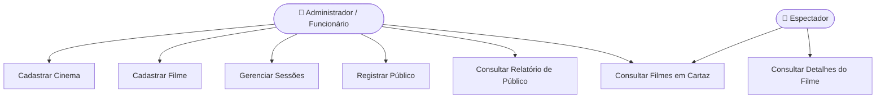
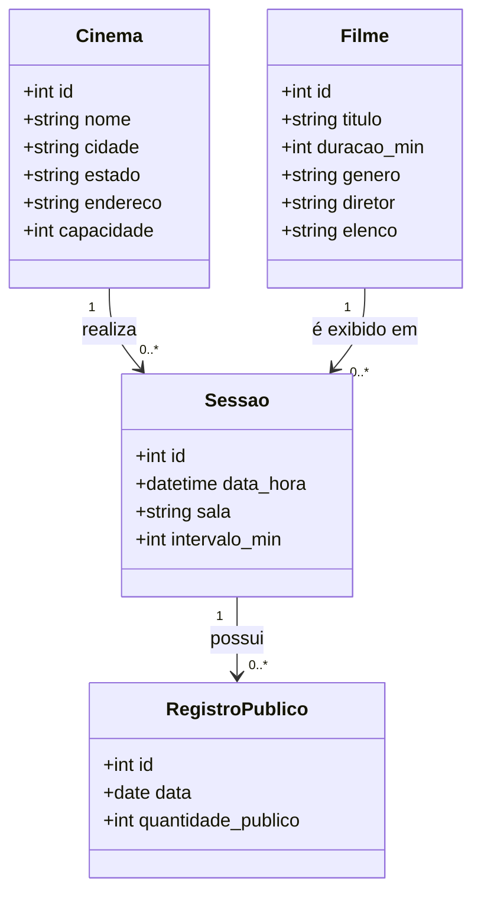
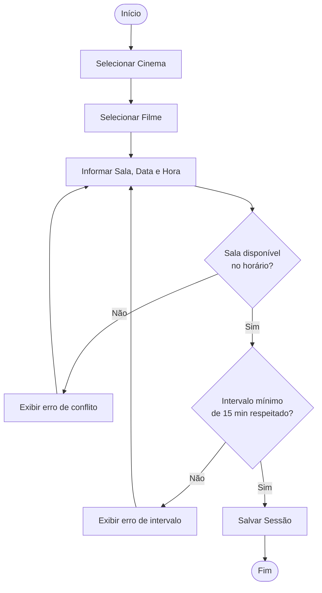
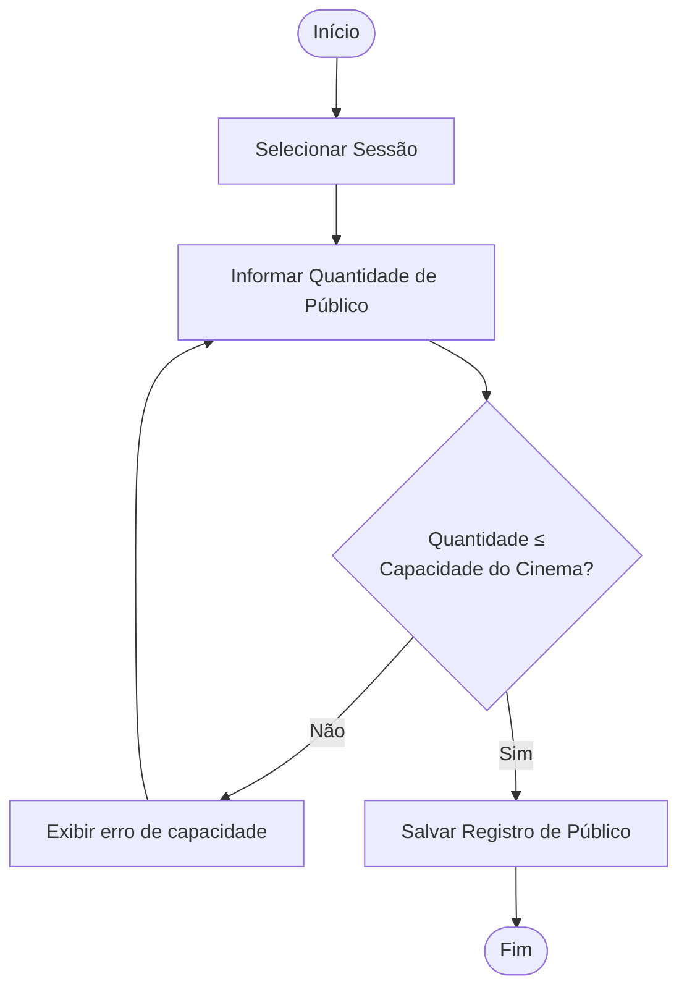
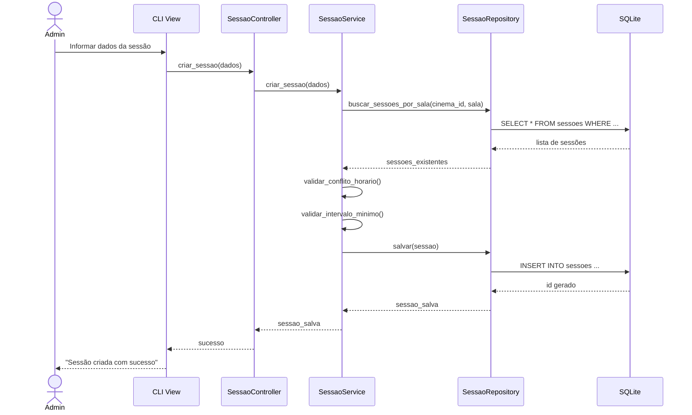
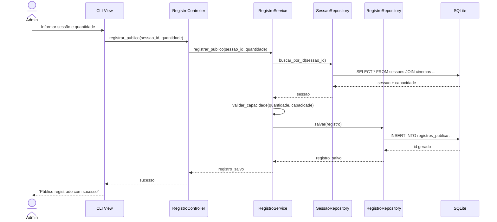

# 🎬 Sistema de Gestão – Rede de Cinemas

**Disciplina:** Engenharia de Software  
**Data:** 07/05/2026  
**Aluno:** Marcio Feo  
**Atividade:** Estudo de Caso – Rede de Cinemas

---

## 📋 Sumário

1. [Requisitos Funcionais e Regras de Negócio](#1-requisitos-funcionais-e-regras-de-negócio)
2. [Diagrama de Casos de Uso](#2-diagrama-de-casos-de-uso)
3. [Diagrama de Classes do Domínio](#3-diagrama-de-classes-do-domínio)
4. [Diagramas de Atividade](#4-diagramas-de-atividade)
5. [Diagramas de Sequência](#5-diagramas-de-sequência)
6. [Arquitetura e Implementação](#6-arquitetura-e-implementação)
7. [Como Executar](#7-como-executar)

---

## 1. Requisitos Funcionais e Regras de Negócio

### 1.1 Requisitos Funcionais

| ID   | Requisito |
|------|-----------|
| RF01 | Cadastrar, editar e consultar cinemas da rede |
| RF02 | Cadastrar, editar e consultar filmes (título, duração, gênero, diretor, elenco) |
| RF03 | Criar sessões vinculando filme, cinema, sala e horário |
| RF04 | Registrar o público diário de cada sessão |
| RF05 | Consultar total de público por sessão |
| RF06 | Consultar total de público por filme |
| RF07 | Consultar total de público por cinema |
| RF08 | Listar filmes em cartaz por cinema |
| RF09 | Consultar elenco, diretor e gênero de um filme |

### 1.2 Regras de Negócio

| ID   | Regra |
|------|-------|
| RN01 | Uma sessão só pode ser criada se não houver conflito de horário na mesma sala e cinema |
| RN02 | O intervalo entre o fim de uma sessão e o início da próxima na mesma sala deve ser de no mínimo 15 minutos |
| RN03 | O público registrado em uma sessão não pode exceder a capacidade do cinema |
| RN04 | A duração de uma sessão é calculada automaticamente com base na duração do filme |
| RN05 | Um filme deve estar cadastrado antes de ser vinculado a uma sessão |
| RN06 | Um cinema deve estar cadastrado antes de receber sessões |

---

## 2. Diagrama de Casos de Uso



---

## 3. Diagrama de Classes do Domínio



---

## 4. Diagramas de Atividade

### 4.1 Criar Sessão



### 4.2 Registrar Público



---

## 5. Diagramas de Sequência

### 5.1 Criar Sessão



### 5.2 Registrar Público



---

## 6. Arquitetura e Implementação

### Estrutura de Pastas

```
cinema-network/
├── src/
│   ├── models/              # Entidades do domínio (POPOs)
│   │   ├── cinema.py
│   │   ├── filme.py
│   │   ├── sessao.py
│   │   └── registro_publico.py
│   ├── repositories/        # Acesso ao banco de dados (SQLite)
│   │   ├── base_repository.py
│   │   ├── cinema_repository.py
│   │   ├── filme_repository.py
│   │   ├── sessao_repository.py
│   │   └── registro_publico_repository.py
│   ├── services/            # Regras de negócio
│   │   ├── cinema_service.py
│   │   ├── filme_service.py
│   │   ├── sessao_service.py
│   │   └── registro_publico_service.py
│   ├── controllers/         # Orquestração entre View e Service
│   │   ├── cinema_controller.py
│   │   ├── filme_controller.py
│   │   ├── sessao_controller.py
│   │   └── registro_publico_controller.py
│   ├── views/               # Interface CLI
│   │   └── cli_view.py
│   ├── database/            # Configuração e inicialização do SQLite
│   │   └── db.py
│   └── main.py              # Ponto de entrada
└── README.md
```

### Padrão Arquitetural

```
View → Controller → Service → Repository → SQLite
```

- **View**: interface de usuário (CLI)
- **Controller**: recebe input, chama service, retorna resposta
- **Service**: aplica regras de negócio
- **Repository**: persiste e recupera dados do SQLite

---

## 7. Como Executar

### Pré-requisitos

- Python 3.8+
- SQLite (já incluso no Python)

### Execução

```bash
# Clonar o repositório
git clone https://github.com/marciofeob/Atividade-Aula-Max---07-05-2026.git
cd Atividade-Aula-Max---07-05-2026

# Executar o sistema
python src/main.py
```

O banco de dados `cinema.db` será criado automaticamente na primeira execução.

---

> Projeto desenvolvido para a disciplina de Engenharia de Software – ADS 2026
